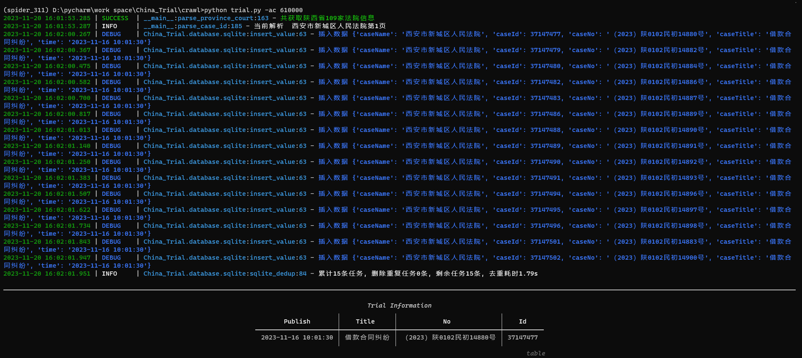
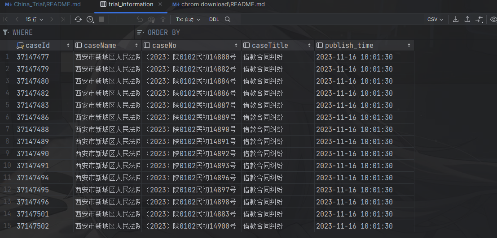

# China-Trial-Parse
## 🐌介绍
本项目针对中国庭审公开网视频数据的爬取，封装了一些常用的爬虫脚本，你可以自己部署或者改造本项目实现更多的功能，也可以直接运行项目中的[trial.py](https://github.com/IcelandT/China-Trial-Spider/tree/main/China_Trial/crawl/trial.py)脚本轻松爬取数据...

---

## 🍪功能
> 💡希望添加的功能可直接提交PR
- [x] 指定案件 ID 的庭审视频爬取
- [x] 指定省份的庭审视频爬取
- [x] 基于 sqlite3 去重
- [ ] 基于 redis 去重
- [ ] 任务种子队列，断点续爬

---

## 🤖脚本
> **trial.py:**
- 运行时需要提供 --area_code 和 --save_path 参数, area_code 代表不同省份的编号, 具体编号可以查看[provincial-code.txt](https://github.com/IcelandT/China-Trial-Spider/tree/main/China_Trial/provincial-code.txt)文件。 save_path 为视频保存路径, 默认为当前项目路径下的 save_video。
```shell
python3 trial.py -ac 350000
```

---

## 🧇食用方法
- 将项目clone至本地机器
```shell
git clone https://github.com/IcelandT/China-Trial-Spider.git 
```
- 安装项目运行时所需的依赖 
```shell
> pip install -r requirements.txt
```
- 前往配置 settings 文件, 添加 cookie 信息, cookie需要登入后自行抓包获取
```python
# Cookies
COOKIE = ""
```
- 运行项目, 选择需要爬取的省份, 省份编号请前往 provincial-code.txt 文件查看
```shell
python3 trial.py -ac 350000
```

---

## 📸截图
<details>
<summary>🔎点击展开截图</summary>

项目运行时:


sqlite数据库情况:


</details>